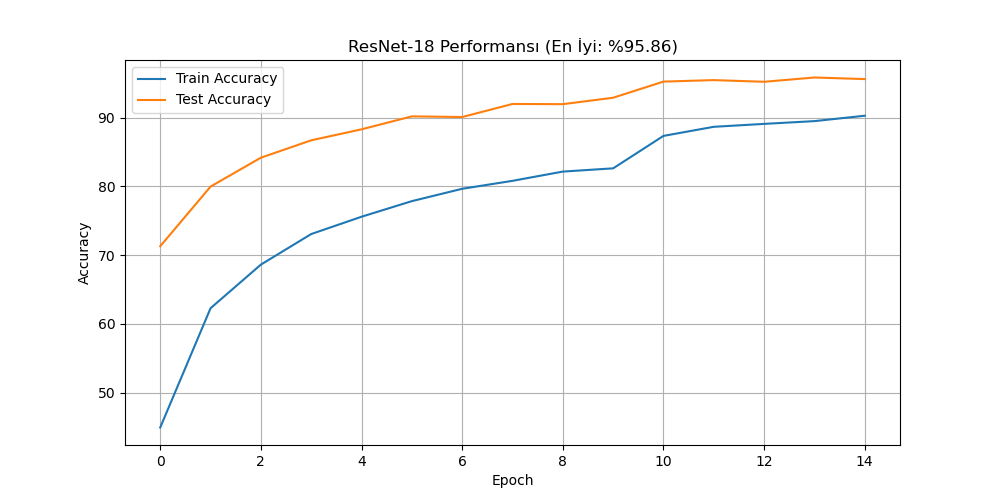

# 🐦 AvianAcoustics: Derin Öğrenme ile Kuş Sesi Sınıflandırma


**AvianAcoustics**, 50 farklı kuş türünü seslerinden yüksek doğrulukla (%95+) tanıyan, ResNet-18 mimarisi üzerine kurulu bir Derin Öğrenme projesidir. Proje, veri işleme aşamasından canlı web arayüzüne kadar uçtan uca (end-to-end) bir çözüm sunar.

---

## 🚀 Proje Özellikleri

* **Model Mimarisi:** ImageNet üzerinde ön eğitilmiş **ResNet-18** (Transfer Learning).
* **Veri İşleme (Smart Slicing):** Uzun ses kayıtları 4 saniyelik parçalara bölünmüş ve RMS (Root Mean Square) analizi ile sessiz/boş kısımlar elenerek veri seti optimize edilmiştir.
* **Ses Dönüşümü:** Ses dalgaları (Waveform), Log-Mel Spektrogramlara dönüştürülerek görüntü işleme teknikleriyle analiz edilmiştir.
* **İnference (Tahmin):** Uzun ses dosyaları için "Sliding Window" (Kayan Pencere) yöntemi ile tüm ses taranır ve ortalama olasılık hesaplanır.
* **Arayüz:** Hugging Face Spaces üzerinde çalışan Gradio tabanlı interaktif web arayüzü.

---

## 📊 Performans ve Sonuçlar

Modelimiz 50 farklı sınıf üzerinde eğitilmiş ve **%95.86 Test Başarısı** elde etmiştir.

### 1. Eğitim Grafiği (Accuracy & Loss)



### 2. Karmaşıklık Matrisi (Confusion Matrix)


---

## 📂 Proje Yapısı

```text
├── dataset/               # Ham ve işlenmiş veriler (Git ignore modunda)
├── models/                # Eğitilmiş .pth modelleri
├── src/
│   ├── slice_audio.py     # Ses dilimleme ve sessizlik temizleme
│   ├── train.py           # Model eğitimi ve validasyon
│   ├── inference.py       # Tahminleme motoru
│   └── app.py             # Gradio web arayüzü
├── ornek_sesler/          # Demo için test sesleri
├── requirements.txt       # Gerekli kütüphaneler
└── README.md              # Proje dokümantasyonu

🧠 Nasıl Çalışır?
Spektrogram Dönüşümü: .mp3 veya .wav formatındaki ses, Mel Skalasında spektrogram görüntüsüne çevrilir.

ResNet-18: Görüntü, CNN (Evrişimli Sinir Ağı) katmanlarından geçer. Modelin ilk katmanı, 1 kanallı (siyah-beyaz) spektrogramları kabul edecek şekilde modifiye edilmiştir.

Sınıflandırma: Son katman, 50 farklı kuş türüne ait olasılık değerlerini üretir.

🌍 Canlı Demo
Projeyi tarayıcı üzerinden test etmek için Hugging Face Space adresini ziyaret edebilirsiniz:

👉 https://huggingface.co/spaces/tottisporlu/kus-sesi-tanima-resnet18
